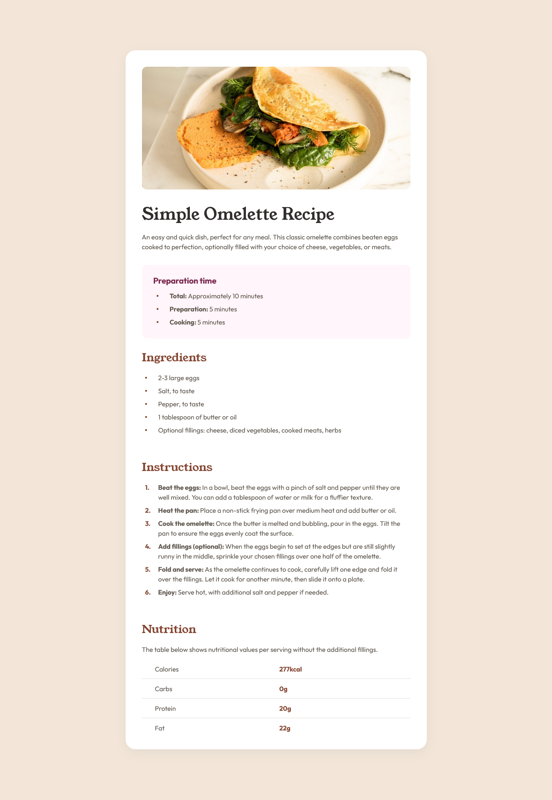

# Frontend Mentor - Recipe page solution

Hi! This is my solution to the [Recipe page challenge on Frontend Mentor](https://www.frontendmentor.io/challenges/recipe-page-KiTsR8QQKm). I tried to complete this challenge using only the references from the resources and my intuition to determine aspects like padding and border-radius. 

## Table of contents

- [Overview](#overview)
  - [Screenshot](#screenshot)
- [My process](#my-process)
  - [Built with](#built-with)
  - [Useful resources](#useful-resources)
- [Author](#author)

## Overview

### Screenshot

This is an example of the component in a "desktop" resolution.

As you can see, the component looks good in mobile resolutions. In this example, the width resolution was set to 375px.

## My process

I am not an expert in designing components, but my process was the following:

1. I created the HTML elements as suggested by Frontend Mentor.
2. Then, I added the style.css sheet.
3. I like to work with variables, so I defined the main variables of my project where I put the colors in hex.
4. After that, I defined the "global aspect" of my project. As I like to work with rem, where 1rem = 10px, I set the font-size in the html to 62.5%.
5. Then, I created the CSS for the component.
6. Finally, I made the media querys for differents screens.

This time I used the "desktop-first" approch because I feel more comfortable working first on a computer and then adding the styles for the mobiles. I also re-used some code that I made from the QR challenge to make the process faster.

### Built with

- Semantic HTML5 markup
- Flexbox
- Grid
- CSS custom properties

### Useful resources

- [w3schools](https://www.w3schools.com/) - This helped me to consult some CSS aspects that I forgot while making the challenge.
- [htmlcolors](https://htmlcolors.com/hsl-to-hex) - This is an online tool that helped me to convert HSL to hex.
- [stack overflow](https://stackoverflow.com/) - I get stuck with the ol text align so I have to make some consults.

## Author

- GitHub - [hcolmenares](https://github.com/hcolmenares)